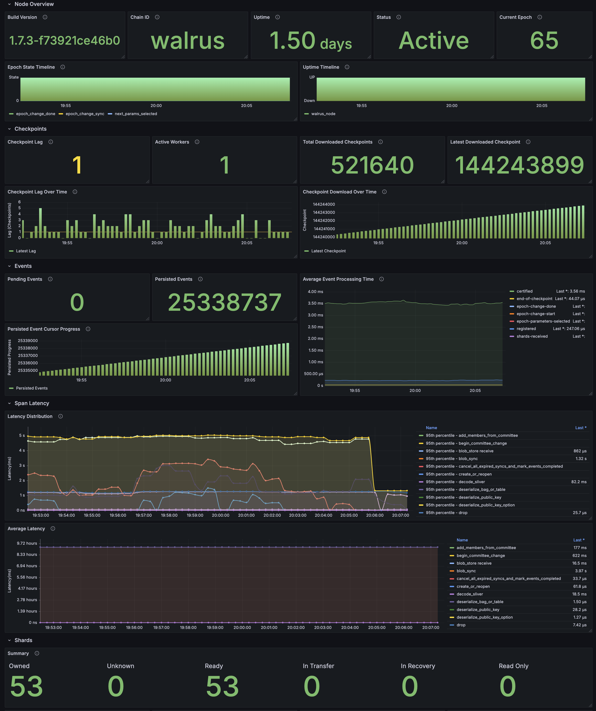
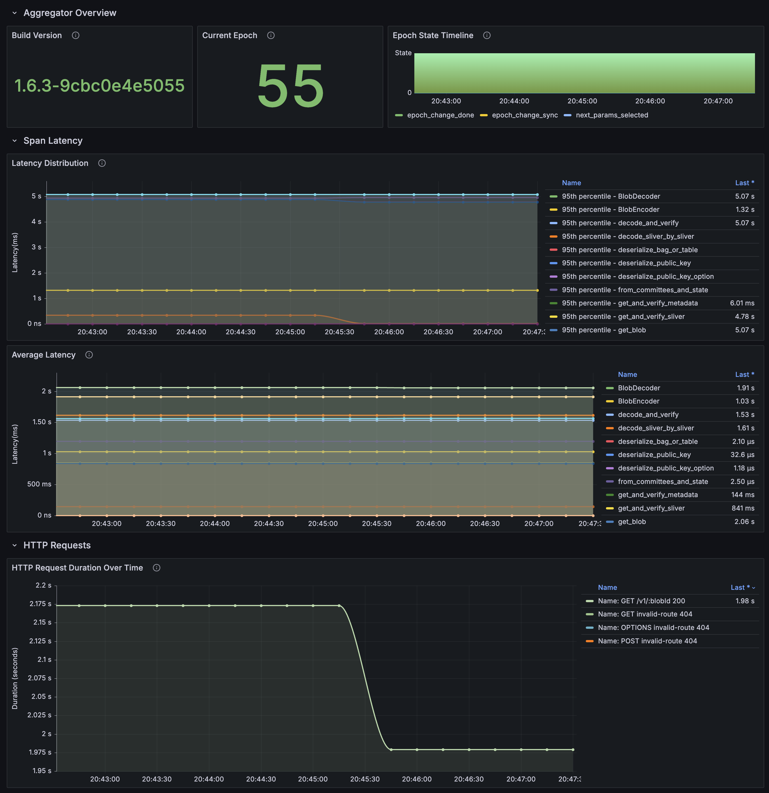

# 🚀 **Walrus Tools**

This repository contains configurations and tools for monitoring and managing the **Walrus network**. It includes setup files for **Grafana**, **Prometheus**, and **Alertmanager**, along with pre-configured dashboards for monitoring the **Walrus Storage Node**, **Aggregator**, and **Publisher services**.

---

## 📦 **Setup and Deployment**

### **1. Clone the Repository**

```bash
git clone https://github.com/walrus-network/walrus-tools.git
```

### **2. Navigate to the Directory**

```bash
cd walrus-tools
```

### **3. Configure Environment Variables**

```bash
cp .env.tmp .env
```

Edit the `.env` file to configure Grafana, Prometheus, Alertmanager, and notification integrations.

### 📑 **Sample `.env` Configuration**

```plaintext
# Grafana Configuration
GF_SECURITY_ADMIN_USER=<admin_user>
GF_SECURITY_ADMIN_PASSWORD=<admin_password>
GF_PORT=3000

# Prometheus Configuration
PROMETHEUS_PORT=9090
PROMETHEUS_TARGET=localhost:9090

# Alertmanager Configuration
ALERTMANAGER_PORT=9093
ALERTMANAGER_TARGET=localhost:9093
ALERTMANAGER_DEFAULT_WEBHOOK_PORT=3001

# Walrus Targets
WALRUS_NODE_TARGET=localhost:9184
WALRUS_AGGREGATOR_TARGET=localhost:27182
WALRUS_PUBLISHER_TARGET=localhost:27183
WALRUS_NODE_URL=https://localhost:9185

# PagerDuty Integration
PAGERDUTY_INTEGRATION_KEY=<your-pagerduty-key>

# Telegram Integration
TELEGRAM_BOT_TOKEN=<your-telegram-bot-token>
TELEGRAM_CHAT_ID=<your-telegram-chat-id>

# Discord Integration
DISCORD_WEBHOOK_URL=<your-discord-webhook-url>

# Slack Integration
SLACK_WEBHOOK_URL=<your-slack-webhook-url>
```

> **Note:** If your targets (`WALRUS_NODE_TARGET`, `WALRUS_AGGREGATOR_TARGET`, `WALRUS_PUBLISHER_TARGET`) are HTTPS endpoints, make sure to include the `https://` protocol explicitly in the variable, e.g., `WALRUS_NODE_TARGET=https://node.example.com`.

---

### **4. Start the Services**

```bash
docker compose up -d
```

This will deploy the containers for **Grafana**, **Prometheus**, and **Alertmanager**.

- **Grafana**: [http://localhost:3000](http://localhost:3000)  
- **Prometheus**: [http://localhost:9090](http://localhost:9090)  
- **Alertmanager**: [http://localhost:9093](http://localhost:9093)

### **5. Verify Services**

Check logs if something doesn't start properly:

```bash
docker compose logs <service_name>
```

---

## 📊 **Access Pre-Configured Dashboards**

### **Grafana Dashboards**

1. **Walrus Storage Node Dashboard**  
   - **Description**: Insights into the performance and status of the Walrus Storage Node, including storage usage, retrieval rates, and latency.
   - **Dashboard File**: [walrus_storage_node.json](./grafana/dashboards/walrus_storage_node.json)  
   

2. **Walrus Aggregator Dashboard**  
   - **Description**: Tracks Aggregator performance metrics such as blob reconstruction rates and operational health.
   - **Dashboard File**: [walrus_aggregator.json](./grafana/dashboards/walrus_aggregator.json)  
   

3. **Walrus Publisher Dashboard**  
   - **Description**: Monitors Publisher service metrics, including HTTP request durations, error rates, and latency.
   - **Dashboard File**: [walrus_publisher.json](./grafana/dashboards/walrus_publisher.json)  
   

---

## 📡 **Dynamic Alert Configuration**

### **Prometheus Alerts**

Alerts are dynamically generated based on environment variables and split into individual rule files:

```
/prometheus/rules/
├── walrus_node_alerts.yml
├── walrus_aggregator_alerts.yml
└── walrus_publisher_alerts.yml
```

### 📑 **Sample Rules**

#### **Walrus Storage Node Alerts**

- **Node Restarted Alert**  
   Triggers if the node uptime hasn’t increased for 5 minutes.  

- **Checkpoint Stuck Alert**  
   Detects if no new checkpoints have been downloaded in the last 5 minutes.  

- **Persisted Events Stuck Alert**  
   Checks if no persisted events were recorded in 5 minutes.

#### **Walrus Aggregator Alerts**

- **High HTTP Server Errors Alert**  
   Triggers when the server error rate (`5xx`) crosses a threshold.  

- **High Client Error Rate Alert**  
   Triggers when the client error rate (`4xx`) crosses a threshold. 

#### **Walrus Publisher Alerts**

- **High HTTP Server Errors Alert**  
   Triggers when the server error rate (`5xx`) crosses a threshold.  

- **High Client Error Rate Alert**  
   Triggers when the client error rate (`4xx`) crosses a threshold.  

---

## 🚨 **Notification Integrations**

### **Alertmanager Notification Targets**

Alerts are dynamically routed to the following targets based on `.env` variables:

- **PagerDuty**: Integrated via `PAGERDUTY_INTEGRATION_KEY`.  
- **Telegram**: Configured using `TELEGRAM_BOT_TOKEN` and `TELEGRAM_CHAT_ID`.  
- **Discord**: Enabled using `DISCORD_WEBHOOK_URL`.
- **Slack**: Enabled using `SLACK_WEBHOOK_URL`.

---

## 🔄 **Restart Services After Configuration Updates**

Whenever `.env` or alert rules change, restart services:

```bash
docker compose restart prometheus alertmanager
```

---

## 🖥️ Platform-Specific Docker Compose Configurations

Docker's network_mode: host works differently on Linux and macOS, requiring separate configurations.

### ⚙️ How to Use Platform-Specific Configurations

- **Linux**: Use `docker-compose.yml` for standard setup.
- **macOS**: Use `docker-compose.macos.yml` for network_mode: host setup.

---

## 🤝 **Contributing**

Contributions are welcome! If you find an issue or have an improvement, please open a pull request or create an issue.

---

## 📝 **License**

This repository is licensed under the **MIT License**. See the [LICENSE](LICENSE) file for details.
